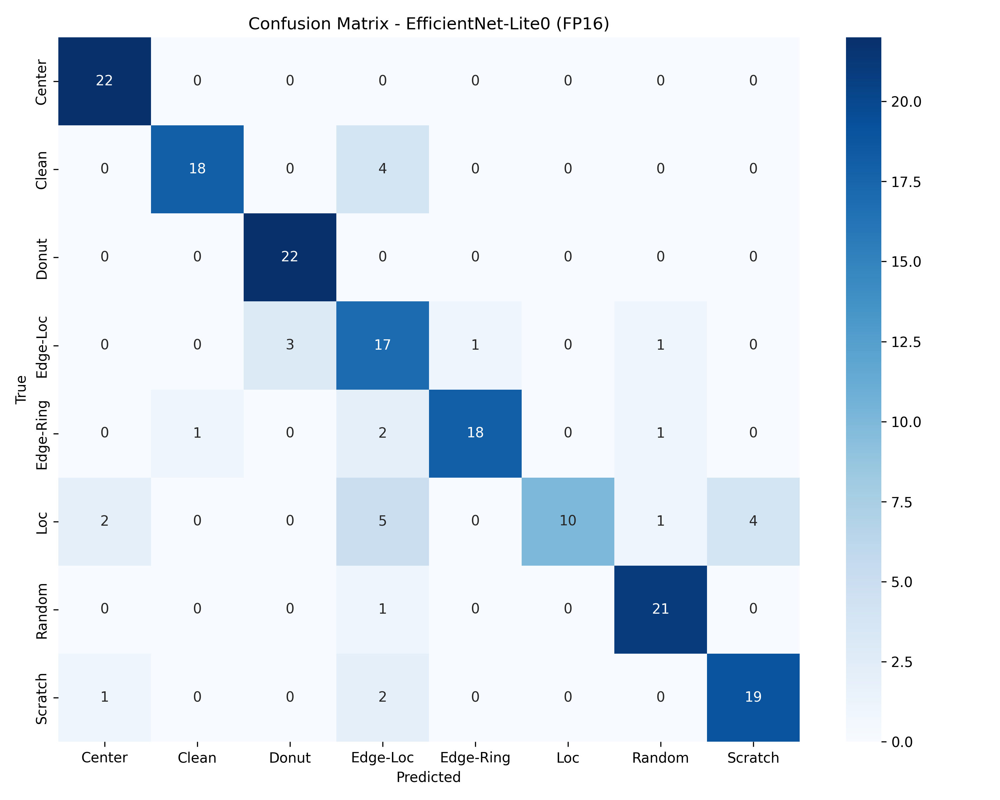

# WaferShield AI: Protecting Semiconductor Yield with Edge AI

---

## Summary

WaferShield AI is an Edge-AI powered defect classification system designed to detect and classify semiconductor wafer defects using deep learning.

The system reflects real fabrication constraints:

- Lightweight model architecture  
- Balanced accuracy vs compute tradeoff  
- Deployment-ready (ONNX export compatible)  
- Structured dataset pipeline  
- Clear evaluation and benchmarking  

Final Test Accuracy Achieved: **90.34%**

Edge Deployment Model:
- EfficientNet-Lite0 (Transfer Learning)
- FP16 ONNX Format
- Model Size: 6.76 MB
- Average Latency: 8.55 ms (CPU)
- Throughput: 116.9 images/sec

---

## Problem Statement

Semiconductor fabrication generates large volumes of wafer inspection images. Manual review and centralized processing introduce:

- High latency  
- Infrastructure overhead  
- Bandwidth limitations  
- Scalability challenges  

WaferShield AI addresses this by enabling defect classification suitable for edge deployment.

---

## Dataset

- Dataset used: WM-811K (LSWMD)
- Dataset link: https://www.kaggle.com/datasets/qingyi/wm811k-wafer-map
- Total available wafer maps: 811,457  

---

### Selected Classes (8 Total)

The following 8 classes were selected:

- Center  
- Clean (mapped from "none")  
- Donut  
- Edge-Loc  
- Edge-Ring  
- Loc  
- Random  
- Scratch  

---

### Dataset Size and Balance

- 149 images per class  
- Total dataset size: 1,192 images  
- Balanced class distribution  

---

### Data Split

- Train: 70%  
- Validation: 15%  
- Test: 15%  
- 22 test samples per class  

Stratified and balanced across all classes.

---

## Model results

Test Accuracy: 90.34%  
Macro F1 Score: ~0.90  

---

## Data Pipeline

### Extraction
- Loaded raw `.pkl` dataset
- Cleaned failureType labels
- Converted wafer maps to grayscale PNG images
- Created structured directory format

### Splitting
- Train / Validation / Test split
- Stratified by class
- Ensured balanced distribution

---

## Model Architecture

Final Architecture: EfficientNet-Lite0 (Transfer Learning)

Why EfficientNet-Lite0?
- Designed for mobile & embedded deployment
- Better accuracy-to-size tradeoff
- Optimized for edge compute constraints

---

## Model Performance

### Test Accuracy
**90.34%**

### Macro F1 Score
~0.90  

### Per-Class Performance

| Class      | Precision | Recall | F1 Score |
|------------|-----------|--------|----------|
| Center     | 0.92      | 1.00   | 0.96     |
| Clean      | 0.91      | 0.91   | 0.91     |
| Donut      | 0.88      | 1.00   | 0.94     |
| Edge-Loc   | 0.67      | 0.91   | 0.77     |
| Edge-Ring  | 1.00      | 0.86   | 0.93     |
| Loc        | 1.00      | 0.64   | 0.78     |
| Random     | 1.00      | 1.00   | 1.00     |
| Scratch    | 1.00      | 0.91   | 0.95     |

Loc remains the most challenging class due to similarity with Edge-Loc.

---

## Confusion Matrix (Test Set)



The model demonstrates strong class-wise performance with clear diagonal dominance.  
Most misclassification occurs between spatially similar defect patterns (Loc vs Edge-Loc), reflecting inherent structural similarity.

---

## Deployment Model (ONNX)

Final Deployment Model:

- Format: FP16 ONNX  
- Model Size: 6.76 MB  
- ONNX Accuracy: 89.77%  

The lightweight ONNX model ensures edge deployment feasibility.

---

## Edge Benchmarking (CPU)

Platform: ONNX Runtime (CPUExecutionProvider)

- Total Test Images: 176  
- Total Inference Time: 1.5056 seconds  
- Average Latency: 8.55 ms per image  
- Throughput: 116.9 images/sec  

This confirms real-time suitability for high-volume inspection environments.

---

## Explainability (Grad-CAM)

Grad-CAM was applied to representative defect samples:

- Center → strong central activation  
- Edge-Loc → boundary-focused activation  
- Random → distributed activation  
- Loc → localized subtle activation  

The model focuses on defect regions rather than wafer background.

---

## Engineering Highlights

- Balanced 8-class dataset construction
- Lightweight edge-optimized model (<7 MB)
- ~90% defect classification accuracy
- Real-time CPU inference (<10 ms per image)
- Grad-CAM explainability integration
- ONNX export and edge deployment readiness
- Structured and reproducible ML pipeline

---

## Key Observations

- EfficientNet significantly improved spatial defect recognition.  
- Loc remains the most challenging due to similarity with Edge-Loc.  
- Validation and test performance are consistent → minimal overfitting.  

The model focuses on defect regions rather than wafer background.

---

## Confusion Matrix (Test Set)


The model demonstrates strong class-wise performance with clear diagonal dominance.  

---

## Project Structure

```
WaferShield-AI/
│
├── data/
│   ├── train/
│   ├── val/
│   └── test/
│
├── results/
│   ├── confusion_matrix.png
│   ├── gradcam_Center.png
│   ├── gradcam_Edge-Loc.png
│   ├── gradcam_Loc.png
│   └── gradcam_Random.png
│
├── src/
│   ├── extract_LSWMD.py        # Raw dataset extraction
│   ├── split_dataset.py        # Train/Val/Test split
│   ├── dataset.py              # Data loaders & preprocessing
│   ├── train.py                # Model training
│   ├── evaluate.py             # PyTorch evaluation
│   ├── confusion_matrix.py     # Confusion matrix generation
│   ├── gradcam.py              # Grad-CAM explainability
│   ├── export_onnx.py          # ONNX export (FP16)
│   ├── onnx_inference.py       # ONNX accuracy testing
│   ├── benchmark.py            # Latency & throughput benchmarking
│   └── quantize_model.py       # Optional quantization experiments
│
├── models/
│   ├── model.pth               # Trained PyTorch weights
│   └── model_fp16.onnx         # Final deployment model (6.76 MB)
│
│
├── Phase1.md                   # Phase 1 submission document (problem, dataset, model, results)
├── README.md                   # Project overview and usage instructions
└── requirements.txt            # Python dependencies for reproducibility
```

---

## How to Run

### Extract Dataset
python src/extract_LSWMD.py

### Split Dataset
python src/split_dataset.py

### Train Model
python src/train.py

### Evaluate Model
python src/evaluate.py

---

## Next Steps (Phase 2 & 3)

- Validate model on hackathon-provided test dataset
- Port model to NXP eIQ flow
- Generate edge deployment artifacts (bit-file)
- Optimize model stack for embedded deployment

---

## Authors

Team: WaferShield AI  
Domain: AI-enabled Chip Design  
Track: Edge-AI Defect Classification